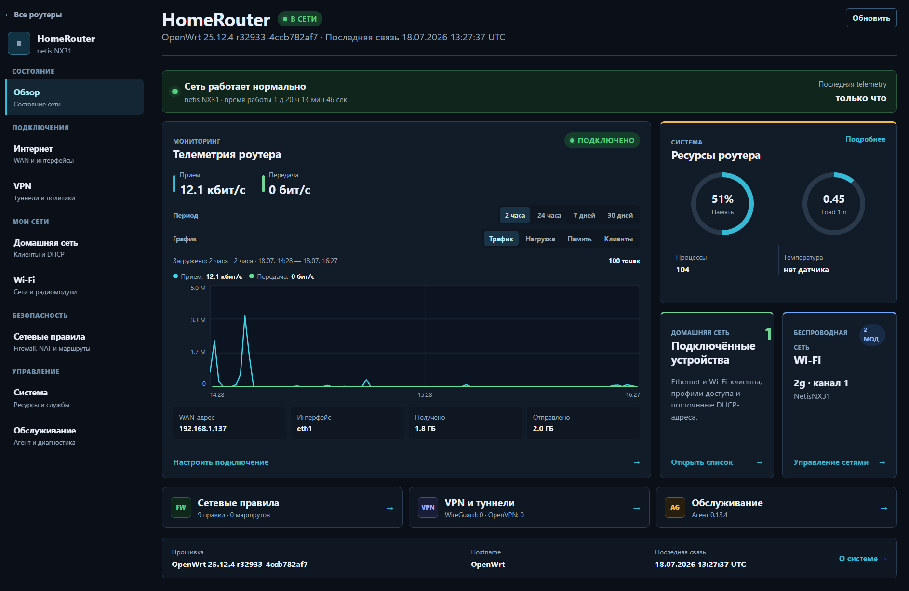
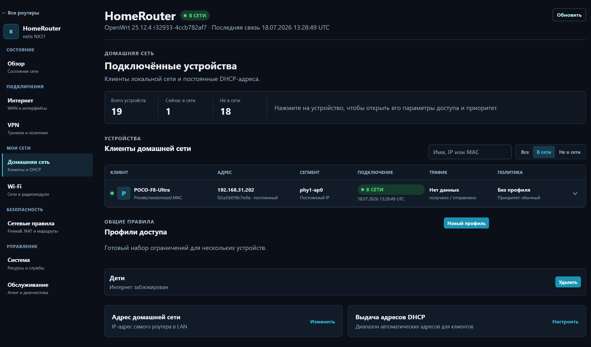
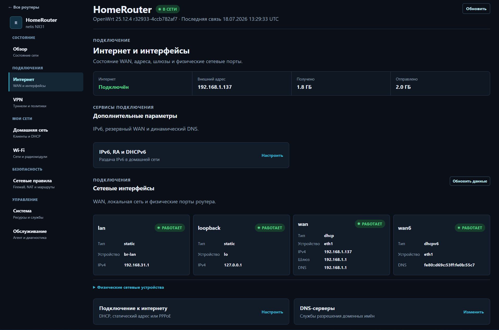

# WrtMonitor

`WrtMonitor` - self-hosted сервер, Web UI, Android-приложение и OpenWrt-агент для мониторинга и удалённого управления роутерами OpenWrt.

## Текущая версия

Текущая стабильная версия: `v0.14.1`.

Главное в `0.14.1`:

- клиенты разделены на подтверждённо активных, недавно замеченных и отключённых;
- DHCP-аренда и старая neighbour-запись больше не создают ложный онлайн;
- Web UI и Android показывают одинаковые статусы, фильтры и источник подтверждения;
- при остановке агента статус клиента автоматически становится неактуальным.

Полная история изменений: [CHANGELOG.md](CHANGELOG.md).

## Что уже есть

- сервер `FastAPI + PostgreSQL + Alembic`;
- текущая модель доступа: `single-owner`, без ролей и мультипользовательского режима;
- Web UI в тёмной dashboard-теме;
- Android-клиент;
- OpenWrt-агент для регистрации, telemetry, очереди команд, diagnostics и автообновления;
- установка через Docker Compose, VPS, домашний Linux-сервер, NAS с Docker и TrueNAS Custom App;
- управление Wi-Fi, сетью, DHCP, системными сервисами, диагностикой и жизненным циклом агента;
- release artifacts для сервера, агента и Android.

## Интерфейс

### Обзор роутера

[](docs/images/web-overview.png)

### Клиенты домашней сети

[](docs/images/web-home-network.png)

### Интернет и интерфейсы

[](docs/images/web-internet.png)

## Быстрый старт

1. Разверните сервер и PostgreSQL через Docker Compose или TrueNAS.
2. Откройте `/setup`.
3. Создайте первого администратора.
4. Проверьте `/health`.
5. Откройте **Аккаунт -> Подключить мобильное приложение**, создайте QR и отсканируйте его в Android. Ручной ввод адреса и вход по паролю остаются доступны.
6. Установите OpenWrt-агент.

Для reverse proxy указывайте внешний HTTPS-адрес:

```env
WRTMONITOR_PUBLIC_SERVER_URL=https://monitor.example.ru
WRTMONITOR_ALLOW_INSECURE_LOCAL=false
```

Для локального временного теста можно включить HTTP:

```env
WRTMONITOR_PUBLIC_SERVER_URL=http://192.168.1.10:8088
WRTMONITOR_ALLOW_INSECURE_LOCAL=true
```

## TrueNAS

Базовый YAML лежит в `deploy/truenas/wrtmonitor-truenas.yaml`.

В релизе он публикуется как:

```text
wrtmonitor-truenas-v0.14.1.yaml
```

Контейнер использует:

```text
ghcr.io/shurshick/wrtmonitor:latest
```

`latest` скачивается при redeploy через **Edit -> Save**, но не обновляет уже запущенный контейнер сам по себе.

## OpenWrt-агент

OpenWrt-агент можно установить:

- с GitHub Release;
- прямо с уже развернутого сервера `https://monitor.example.ru/downloads/openwrt/`.

Сервер раздаёт:

- `wrtmonitor-agent`
- `wrtmonitor.init`
- `install-openwrt.sh`
- `agent-version.txt`
- `openwrt-agent-files.txt`
- `SHA256SUMS.txt`
- `lib/*.sh`

Подробности:

- [OpenWrt agent](docs/openwrt-agent.md)
- [Развёртывание сервера](docs/server-deployment.md)
- [Эксплуатация и восстановление](docs/server-operations.md)
- [Router management core](docs/router-management-core.md)

## Документация

- [OpenWrt agent](docs/openwrt-agent.md)
- [Развёртывание сервера](docs/server-deployment.md)
- [API](docs/api.md)
- [Архитектура](docs/architecture.md)
- [Жизненный цикл команд](docs/command-lifecycle.md)
- [Проверка на реальном роутере](docs/real-router-testing.md)
- [Android](docs/android.md)
- [Roadmap](docs/roadmap.md)
- [Changelog](CHANGELOG.md)

История релизов теперь ведётся в одном месте: [CHANGELOG.md](CHANGELOG.md). Отдельные старые промежуточные release notes больше не поддерживаются.
