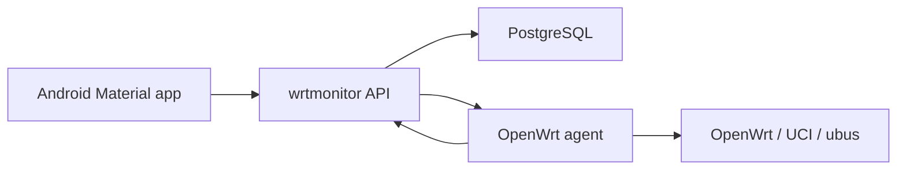

# Архитектура wrtmonitor

`wrtmonitor` состоит из трёх частей:

1. Сервер хранит пользователей, устройства, telemetry и очередь команд.
2. OpenWrt agent регистрируется на сервере, отправляет состояние и забирает команды.
3. Android-приложение показывает состояние и создаёт команды управления через сервер.

## Поток данных

## Управление роутером

Команды не исполняются сервером напрямую. Сервер создаёт запись в `device_commands`, а agent забирает её при polling.

Такой подход работает за NAT и не требует открывать входящий порт на роутере.

## База данных

Сервер сразу использует PostgreSQL. SQLite в проект не добавляется, чтобы не тащить отдельный путь миграций и поведения для MVP.

## Границы безопасности

- Android общается только с сервером.
- OpenWrt agent сам подключается к серверу и забирает команды.
- Сервер принимает только команды из allowlist.
- Произвольное выполнение shell/UCI-команд не является частью MVP.
