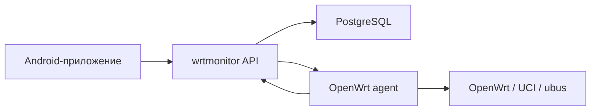

# Архитектура wrtmonitor

`wrtmonitor` состоит из четырёх основных частей:

1. Сервер хранит пользователей, устройства, телеметрию и очередь команд.
2. PostgreSQL хранит постоянные данные сервера.
3. OpenWrt agent регистрирует роутер, отправляет телеметрию и забирает команды с сервера.
4. Android-приложение подключается к серверу, показывает устройства и текущую телеметрию.

## Поток данных



## Сервер

Сервер запускается в Docker и рассчитан на установку на VPS, домашний Linux-сервер, NAS с Docker или TrueNAS Custom App.

Основные обязанности сервера:

- первичная настройка и создание администратора через `/setup`;
- авторизация пользователей;
- регистрация роутеров через `/api/v1/devices/provision`;
- приём телеметрии от агента;
- выдача последней телеметрии для Android и Web UI;
- хранение очереди команд для агента;
- миграции схемы базы через Alembic.

Сервер сразу использует PostgreSQL. SQLite не используется для production-сценария, чтобы не поддерживать две разные схемы хранения и миграций.

## OpenWrt Agent

Агент работает на самом роутере как init.d-сервис. Он не открывает входящий порт наружу и сам подключается к серверу.

Текущий агент умеет:

- проходить первичную регистрацию через логин и пароль администратора;
- сохранять `server_url`, `device_id` и `device_token` в UCI;
- отправлять heartbeat и telemetry;
- собирать uptime, load average и Wi-Fi snapshot через `ubus`;
- деградировать без падения, если часть OpenWrt-команд недоступна;
- забирать команды из очереди сервера;
- выполнять только команды из allowlist.

## Android

Android-приложение подключается к тому же серверу, что и OpenWrt agent.

Текущая тестовая версия умеет:

- запрашивать адрес сервера при первом входе;
- авторизоваться логином и паролем администратора;
- показывать список устройств;
- открывать экран устройства;
- показывать статус, последнюю связь и telemetry snapshot.

Управление роутером из Android будет расширяться постепенно: сначала безопасные команды из allowlist, затем настройки Wi-Fi, сети и клиентских устройств.

## Телеметрия

Агент отправляет телеметрию в `/api/v1/agent/telemetry`. Сервер хранит историю и оставляет последние 100 снимков на устройство.

Android и Web UI используют API последней телеметрии:

```text
GET /api/v1/devices/{device_id}/telemetry/latest
```

Ответ содержит сам snapshot, возраст данных, признак устаревания и источник данных.

## Команды

Команды не исполняются сервером напрямую. Сервер создаёт запись в очереди, а агент сам забирает её при polling.

Такой подход:

- работает за NAT;
- не требует открывать входящий порт на роутере;
- позволяет ограничить список разрешённых действий;
- даёт место для статусов команд и аудита.

## Безопасность

Текущие границы безопасности:

- сервер не стартует с дефолтными JWT/DB-секретами;
- устройство авторизуется device token;
- device token хранится на сервере только в виде hash;
- Android работает через авторизацию администратора;
- Web UI `/devices` требует сессию;
- команды ограничены allowlist;
- произвольное выполнение shell-команд не входит в MVP.
