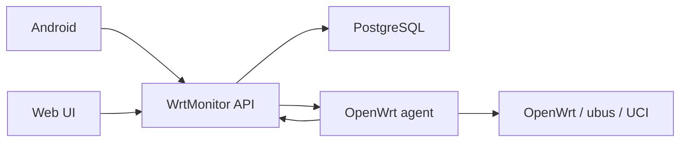

# Архитектура WrtMonitor

## Компоненты

1. Сервер `FastAPI` хранит пользователя-владельца, устройства, telemetry и очередь команд.
2. `PostgreSQL` хранит постоянные данные.
3. OpenWrt agent работает на роутере как `init.d`-сервис.
4. Android и Web UI подключаются только к серверу, а не напрямую к роутеру.

## Поток данных



## Command architecture

Сервер не выполняет команды на роутере напрямую. Он только:

1. валидирует команду;
2. проверяет capability;
3. ставит команду в очередь;
4. отдает ее agent при polling;
5. сохраняет результат выполнения.

Командный слой строится вокруг `COMMAND_REGISTRY`, где для каждой команды определены:

- `risk_level`
- `capability`
- `requires_confirmation`
- `secret_fields`

## Access model

Текущая модель сознательно простая: `single-owner`.

- один сервер = один владелец;
- Android и Web UI работают от имени этого владельца;
- устройства не привязаны к разным пользователям;
- роли и мультипользовательский режим пока не включены.

Это сейчас правильнее, чем держать полуживую модель пользователей и делать вид, что она полноценно работает.

## Capabilities

Начиная с `v0.3.0-rc6`, agent публикует capability report schema v4:

- версию;
- платформу;
- `capabilities_version`;
- булевы capabilities.
- `capability_details` с признаком поддержки и причиной недоступности.

Поддержка определяется по фактическому окружению: UCI-конфигурациям, ubus, init-сервисам, установленным утилитам и наличию Wi-Fi radio/iface.

Capabilities передаются в latest telemetry и через `GET /api/v1/devices/{device_id}/agent`.

Если capabilities отсутствуют, сервер, Web UI и Android переходят в safe fallback:

- read-only;
- без новых опасных действий.

## Telemetry

Agent отправляет snapshot в:

```text
POST /api/v1/agent/telemetry
```

Последний snapshot доступен через:

```text
GET /api/v1/devices/{device_id}/telemetry/latest
```

В latest telemetry теперь есть нормализованные блоки:

- `agent`
- `wifi`
- `network`

Это дает UI стабильную структуру без ручного разбора raw JSON.

## Wi-Fi management safety

Перед командами:

- `wifi.set_enabled`
- `wifi.set_ssid`
- `wifi.set_password`

agent создает backup `/etc/config/wireless`. Если backup не создался, команда не применяется.

## Diagnostics

Agent поддерживает:

- `check-server`
- `check-dns`
- `check-route`
- `check-wifi`
- `check-dependencies`
- `diagnostics --json`

Backend отдает diagnostics через обычный command lifecycle, а Web UI и Android показывают результат как structured JSON.

## Устройства

Устройство может быть:

- `provisioned`
- `online`
- `offline`
- `disconnecting`
- `disabled`

Удаление устройства безвозвратное и доступно владельцу для любого состояния:

- удаляется запись роутера и становится недействительным device token;
- каскадно очищаются telemetry и все команды;
- удаляются связанные записи аудита устройства и команд;
- для повторного подключения агент нужно зарегистрировать заново.
